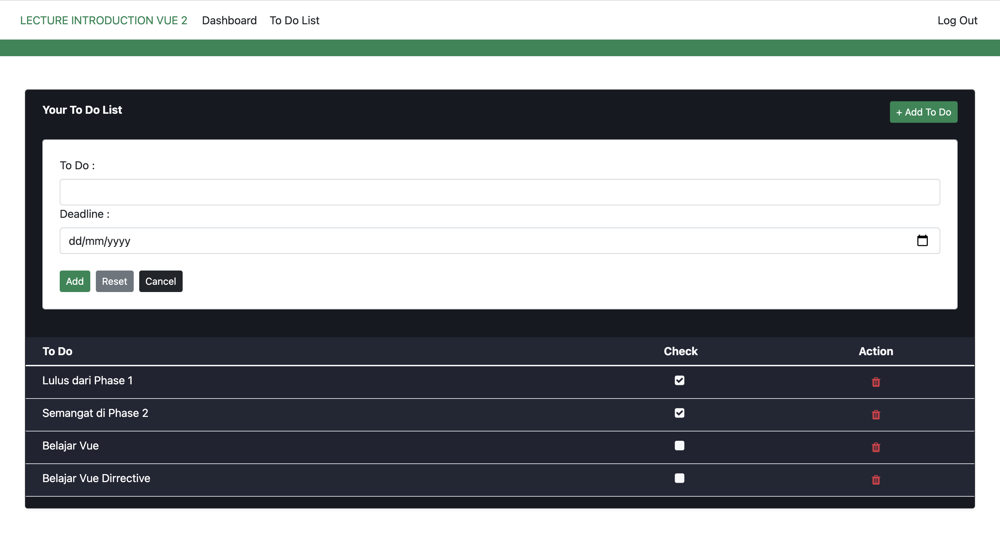
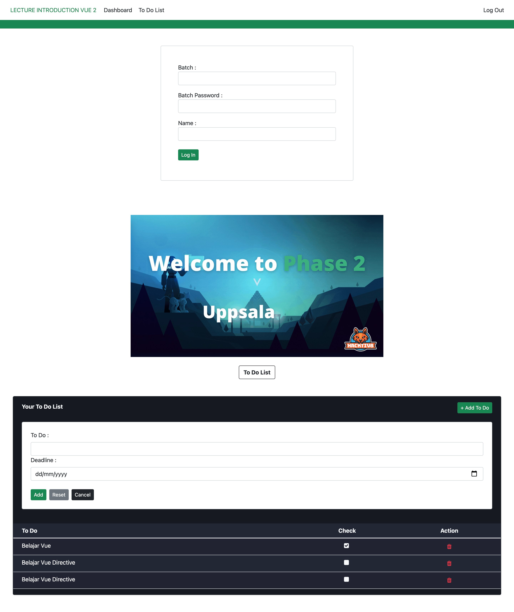

# Implement Vue Dirrective

- Data Binding `{{mustache}}`    
 (value variable/property to Vue)
- Conditional `v-if v-else-if v-else` 
- Toggle Display `v-show`
- Looping `v-for`
- Event Handling `v-on:... @....`

### Dashboard   

### To Do List 

## Template

